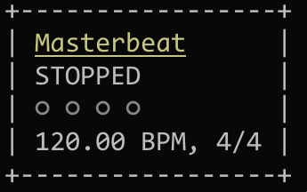

# masterbeat

<p align="center">
    
</p>

`masterbeat` is a TUI metronome to help you master you beat.

## Usage

### Running

Navigate to source folder and run

```bash
go run .
```

See `go run . -help` for list of flags.

### Keybinds

| Key        | Action                |
| ---------- | --------------------- |
| q          | quit                  |
| space      | pause/resume          |
| up         | increment BPM by 1    |
| shift+up   | increment BPM by 10   |
| ctrl+up    | increment BPM by 0.05 |
| down       | decrement BPM by 1    |
| shift+down | decrement BPM by 10   |
| ctrl+down  | increment BPM by 0.05 |

## TODO

- [x] Basic functionality
- [ ] Cool UI
- [ ] Build a binary
- [ ] Add BPM tapping function
- [ ] Add basic drum beats
